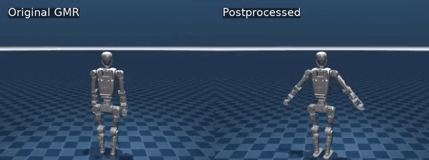

# GMR ELF3 Web 工具

[English README](README.md)

这个仓库是在 [GMR: General Motion Retargeting](https://github.com/YanjieZe/GMR) 基础上做的内部 Web 封装，主要用于把人体动作数据转换成 ELF3 机器人动作。

它通常和 `gvhmr-web-tool` 一起使用：

- `gvhmr-web-tool`：负责 `视频 -> hmr4d_results.pt / gvhmr_data.npz`。
- `gmr-web-tool`：负责 `hmr4d_results.pt / BVH / SMPL-X -> ELF3 robot_motion.pkl / 预览视频`。

## 这个仓库增加了什么

- 本地 Gradio/FastAPI Web 页面。
- GMR 任务历史、状态持久化和结果打包下载。
- 从 GVHMR 结果直接转 ELF3 的入口。
- 手动生成优化版动作的后处理能力。
- 原始预览和优化预览的并排对比。
- 视频对比支持同步播放、同步进度、重置和倍速播放。
- ELF3 相关 IK 配置文件。

## 效果预览

下面的 GIF 展示同一个 BVH 动作在 GMR 原始结果和后处理优化结果之间的对比。



左侧：原始 `robot_preview.mp4`。右侧：优化后的 `preview_foot.mp4`。

[打开完整 MP4 预览](docs/media/balei_original_vs_postprocess.mp4)

## 重要说明：ELF3 资产不公开

`assets/elf3/` 不会提交到 public 仓库。

内部使用时，需要把 ELF3 的 MuJoCo XML 和 mesh 文件复制到：

```bash
assets/elf3/
```

期望结构：

```text
assets/elf3/elf3.xml
assets/elf3/meshes/*.STL
```

以下内容也不会提交到 git：

- `runtime/`
- `outputs/`
- `exports/`
- `pkl / pt / ckpt`
- SQLite 数据库
- SMPLX body model

只有 `docs/media/` 里的小体积说明视频会进入仓库，用于 README 展示。

## 启动方式

第一版复用现有 `gvhmr` conda 环境：

```bash
cd gmr-web-tool
pip install -e .
bash start_gmr_web.sh
```

局域网模式：

```bash
bash start_gmr_web_lan.sh
```

默认本机地址：

```text
http://127.0.0.1:7870/ui
```

局域网模式会在终端打印类似：

```text
http://<LAN_IP>:7870/ui
```

## Web 页面怎么用

### 单文件转换

支持上传：

- `hmr4d_results.pt`
- SMPL-X `.npz`
- BVH 文件
- 支持的离线 motion `.pkl`

常用默认参数：

- `robot=elf3`
- `source_type=auto`
- `ground_clearance=0.03`
- `smoothing_alpha=0.35`
- `generate_video=true`

转换完成后会生成：

```text
robot_motion.pkl
robot_preview.mp4
artifacts.zip
job.json
```

### 从 GVHMR 结果转换

在统一入口中使用时，GMR 页面可以读取最近成功的 GVHMR 任务。

这样不需要手动寻找 `hmr4d_results.pt`，可以直接选择刚才的视频结果并提交 ELF3 转换。

### 任务历史

历史页做成紧凑布局：

- 顶部选择任务和复制 job_id。
- 中间查看任务摘要和视频对比。
- 下载原始结果和优化结果。
- 任务列表、质量摘要、日志和完整详情默认折叠。

原始/优化视频对比支持：

- 同步播放 / 暂停
- 同步进度
- 重置到开头
- 0.25x / 0.5x / 1x / 1.5x / 2x 倍速

## 后处理工具

详细说明见：

```text
tools/README_motion_postprocess.md
```

只做质量诊断：

```bash
PYTHONNOUSERSITE=1 conda run -n gvhmr python tools/motion_postprocess.py quality \
  --input runtime/jobs/xxx/robot_motion.pkl \
  --robot elf3
```

生成优化版动作和预览视频：

```bash
PYTHONNOUSERSITE=1 conda run -n gvhmr python tools/motion_postprocess.py optimize \
  --input runtime/jobs/xxx/robot_motion.pkl \
  --robot elf3 \
  --profile soft \
  --pipeline v2_foot \
  --render
```

推荐默认输出：

```text
motion_foot.pkl
preview_foot.mp4
quality_foot.json
```

当前后处理主要用于预览级优化，包括：

- 减少肩、肘、腕等关节抽动。
- 限制关节速度、加速度和 jerk。
- 修复四元数符号跳变。
- 轻量 foot-lock，缓解脚滑。
- 生成质量报告，辅助判断动作是否稳定。

注意：后处理不等于真机安全验证。如果要上真机，还需要控制器侧限速、动力学约束、碰撞检查和安全保护。

## 稳定性评测工具

仓库提供了只读评测脚本，用来量化 ELF3 动作的重心、支撑脚范围和躯干姿态。它只生成报告，不会修改 `robot_motion.pkl`，适合用来判断“撅屁股、上身前倾、重心是否偏出支撑面”等问题。

评测默认不会自动执行。需要评测时，手动运行：

```bash
PYTHONNOUSERSITE=1 conda run --no-capture-output -n gmr \
python scripts/diagnose_robot_stability.py \
  --robot elf3 \
  --motion_path runtime/jobs/xxx/robot_motion.pkl
```

默认会在同目录生成：

```text
robot_motion_stability.json
robot_motion_stability.csv
```

报告里的常用指标：

- `outside_support_percent`：COM 投影落在支撑脚范围外的帧比例。
- `min_support_margin_m`：COM 到支撑多边形边界的最小有符号距离，负数表示在外面。
- `p95_abs_com_forward_from_support_m`：COM 相对支撑脚中心的前后偏移 95 分位。
- `p95_abs_torso_forward_lean_deg`：躯干前后倾角 95 分位。
- `p95_abs_waist_forward_lean_deg`：腰部前后倾角 95 分位。

诊断脚本常用参数：

- `--root_rot_format xyzw|wxyz`：指定 `robot_motion.pkl` 里根节点四元数格式。Web/GVHMR 标准输出通常是 `xyzw`；某些旧版 BVH 脚本输出可能是 `wxyz`。
- `--support_height 0.08`：判断支撑脚的高度阈值，单位是米。脚底 site 距离最低脚不超过这个高度时，会被认为是支撑脚。阈值越大，越容易把抬起不高的脚也算作支撑脚。

如果要从 BVH 跑一遍原始 GMR 并顺便生成评测报告，可以手动运行：

```bash
PYTHONNOUSERSITE=1 conda run --no-capture-output -n gmr \
python scripts/retarget_bvh_stability_experiment.py \
  --robot elf3 \
  --bvh_file "/path/to/motion.bvh" \
  --bvh_format 3DSM \
  --scale 0.01 \
  --reset_to_zero \
  --ground_clearance 0.03 \
  --smoothing_alpha 0.35 \
  --save_path runtime/stability_experiments/motion.pkl
```

注意：这个脚本使用原始 GMR retarget，不包含额外重心约束、姿态约束或优化项。

## 仿真显示和相机参数

`scripts/xsens_bvh_to_robot.py`、`scripts/vis_robot_motion.py` 和
`scripts/vis_robot_motion_dataset.py` 的 MuJoCo 预览默认使用
`camera_mode=track`，并默认显示 COM 投影和支撑脚范围。这些只是可视化辅助，不会改变 retarget 结果。

常用最短命令：

```bash
PYTHONNOUSERSITE=1 conda run --no-capture-output -n gmr \
python scripts/xsens_bvh_to_robot.py \
  --robot elf3 \
  --bvh_file "/path/to/motion.bvh" \
  --bvh_format 3DSM \
  --scale 0.01 \
  --reset_to_zero \
  --ground_clearance 0.03 \
  --smoothing_alpha 0.35
```

已有 pkl 可以直接用同样的默认显示效果回放：

```bash
PYTHONNOUSERSITE=1 conda run --no-capture-output -n gmr \
python scripts/vis_robot_motion.py \
  --robot elf3 \
  --robot_motion_path "/path/to/robot_motion.pkl"
```

默认行为：

- 相机默认是 `--camera_mode track`：视角中心跟随机器人，鼠标仍可自由旋转和缩放。
- 默认显示 COM 地面投影，相当于开启 `--show_com_projection`。
- 默认显示支撑脚范围，相当于开启 `--show_support_polygon`。
- 默认不录制视频，只有仿真窗口预览。
- 默认不生成稳定性评测报告。

需要时再追加：

- `--no-show_com_projection`：隐藏机器人 COM 和地面投影。
- `--no-show_support_polygon`：隐藏估计的支撑脚范围。
- `--camera_mode fixed`：视角中心跟随机器人，同时每帧重置距离和俯仰角，画面更稳定但视角自由度低。
- `--camera_mode free` 或 `--free_camera`：完全自由相机，不自动跟随机器人。
- `--record_video --video_path videos/example.mp4`：手动生成 mp4 预览视频。
- `--save_path runtime/stability_experiments/motion.pkl`：手动保存 `robot_motion.pkl`，之后可再用 `diagnose_robot_stability.py` 做评测。

可视化里的颜色含义：

- 黄色地面点：COM 在地面的投影。
- 红色小球：机器人三维 COM。
- 黄色竖线：COM 到地面投影的连线。
- 蓝色半透明脚框：当前估计参与支撑的脚底范围。
- 绿色外框：双脚同时支撑时的合并支撑多边形。

如果分析的是某些旧版 `xsens_bvh_to_robot.py` 直接保存的 pkl，根节点四元数可能是 `wxyz`，可以显式指定：

```bash
PYTHONNOUSERSITE=1 conda run --no-capture-output -n gmr \
python scripts/diagnose_robot_stability.py \
  --robot elf3 \
  --motion_path path/to/legacy_bvh_robot_motion.pkl \
  --root_rot_format wxyz
```

## 仓库关系

本仓库只维护 GMR 到 ELF3 的 Web 封装和后处理工具。

GVHMR 视频转人体数据部分在另一个仓库：

```text
gvhmr-web-tool
```

## 上游项目

本仓库包含并修改了上游 MIT 协议的 GMR 代码。

上游项目：

```text
https://github.com/YanjieZe/GMR
```
