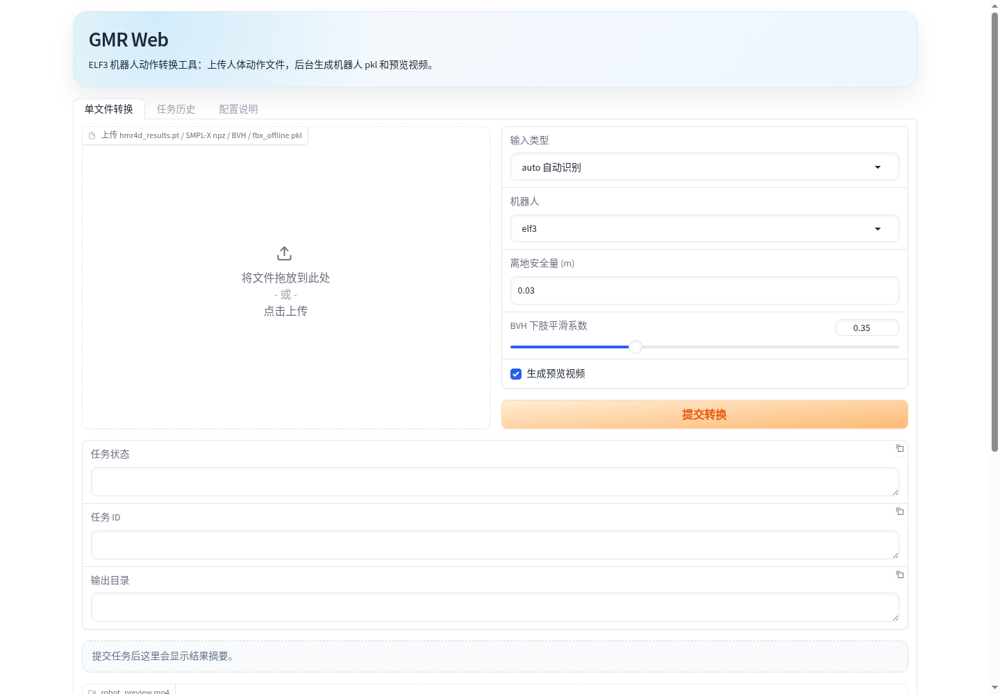

# GMR ELF3 Web 工具

[English README](README.md)

这个仓库是在 [GMR: General Motion Retargeting](https://github.com/YanjieZe/GMR) 基础上做的 Web 封装，主要负责把人体动作数据转换成 ELF3 机器人动作。

它通常和 `gvhmr-web-tool` 一起使用：

- `gvhmr-web-tool`：负责 `视频 -> hmr4d_results.pt / gvhmr_data.npz`。
- `gmr-web-tool`：负责公开版原始 GMR Web 化，生成 `robot_motion.pkl / robot_preview.mp4`。
- `gmr-optimizer`：可选的本地优化后端，负责碰撞避免、后处理、评测和实验。

## 这个仓库增加了什么

- 本地 Gradio/FastAPI Web 页面。
- GMR 任务历史、状态持久化和结果打包下载。
- 从 GVHMR 结果直接转 ELF3 的入口。
- 可选 external backend 接口，用于本地调用 `gmr-optimizer`。
- ELF3 相关 IK 配置文件。

## 界面预览

公开版 Web 默认提供单文件转换、任务历史和配置说明，重点保持上传、转换、预览和下载流程简单清晰。



## 重要说明：ELF3 资产不公开

`assets/elf3/` 不会提交到 public 仓库。

内部使用时，需要把 ELF3 的 MuJoCo XML 和 mesh 文件复制到：

```bash
assets/elf3/
```

期望结构：

```text
assets/elf3/elf3.xml
assets/elf3/meshes/*.STL
```

以下内容也不会提交到 git：

- `runtime/`
- `outputs/`
- `exports/`
- `pkl / pt / ckpt`
- SQLite 数据库
- SMPLX body model

## 启动方式

第一版复用现有 `gvhmr` conda 环境：

```bash
cd gmr-web-tool
pip install -e .
bash start_gmr_web.sh
```

局域网模式：

```bash
bash start_gmr_web_lan.sh
```

默认本机地址：

```text
http://127.0.0.1:7870/ui
```

局域网模式会在终端打印类似：

```text
http://<LAN_IP>:7870/ui
```

## Web 页面怎么用

### 单文件转换

支持上传：

- `hmr4d_results.pt`
- SMPL-X `.npz`
- BVH 文件
- 支持的离线 motion `.pkl`

常用默认参数：

- `robot=elf3`
- `source_type=auto`
- `ground_clearance=0.03`
- `smoothing_alpha=0.35`
- `generate_video=true`

转换完成后会生成：

```text
robot_motion.pkl
robot_preview.mp4
artifacts.zip
job.json
```

### 从 GVHMR 结果转换

在统一入口中使用时，GMR 页面可以读取最近成功的 GVHMR 任务。

这样不需要手动寻找 `hmr4d_results.pt`，可以直接选择刚才的视频结果并提交 ELF3 转换。

### 任务历史

历史页做成紧凑布局：

- 顶部选择任务和复制 job_id。
- 中间查看任务摘要和预览视频。
- 下载 `robot_motion.pkl`、`robot_preview.mp4` 和 `artifacts.zip`。
- 任务列表、日志和完整详情默认折叠。

如果配置了 `gmr-optimizer` external backend，历史页会额外显示优化结果和质量报告。

## 本地优化后端

公开版默认只走原始 GMR。若本地需要使用优化版 GMR 和后处理，先准备 `gmr-optimizer`，再设置：

```bash
export GMR_BACKEND=external
export GMR_RETARGET_CMD=/home/user-kevien/gvhmr_pkg/gmr-optimizer/run_retarget.sh
export GMR_POSTPROCESS_CMD=/home/user-kevien/gvhmr_pkg/gmr-optimizer/run_postprocess.sh
```

不设置这些变量时，Web 仓库不加载优化逻辑，也不依赖后处理脚本。

## 仓库关系

本仓库只维护 GMR 到 ELF3 的 Web 封装。ELF3 优化、后处理和实验报告放在 `gmr-optimizer`。

GVHMR 视频转人体数据部分在另一个仓库：

```text
gvhmr-web-tool
```

## 上游项目

本仓库包含并修改了上游 MIT 协议的 GMR 代码。

上游项目：

```text
https://github.com/YanjieZe/GMR
```
